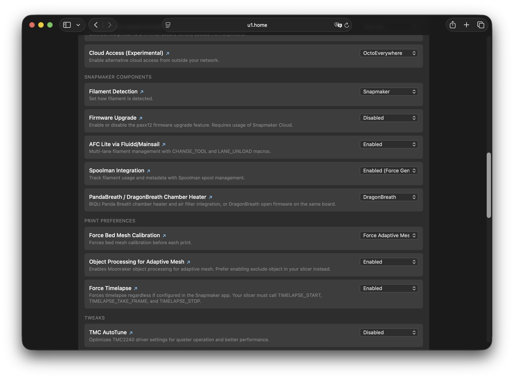
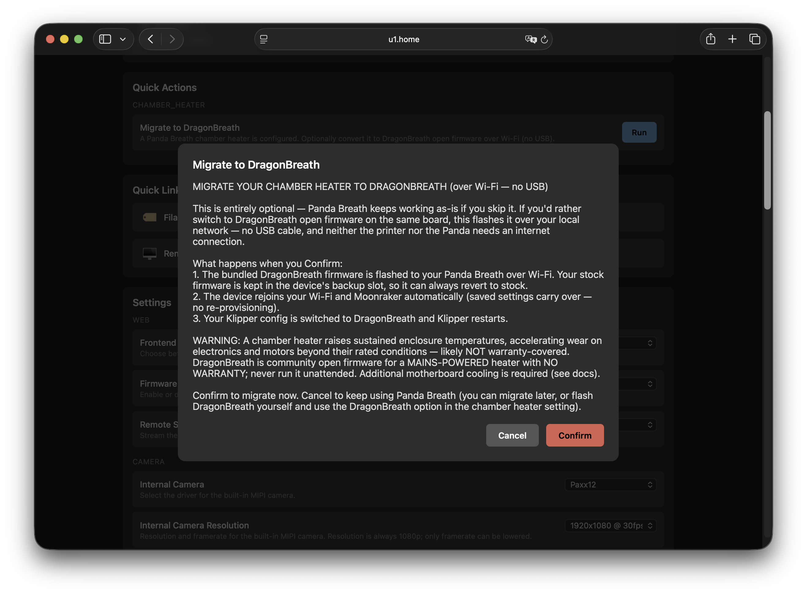

# Chamber Heater

The Snapmaker U1 can drive an external chamber heater through Klipper, using the
[BIQU Panda Breath](https://biqu.equipment/products/biqu-panda-breath-smart-air-filtration-and-heating-system-with-precise-temperature-regulation)
board with either of two firmwares:

- **[DragonBreath](#dragonbreath) — recommended.** Community open firmware flashed
  onto the Panda Breath board. Actively maintained, with an on-device safety model,
  and the path this firmware standardises on.
- **[Panda Breath](#panda-breath).** BIQU's stock firmware, controlled over its
  WebSocket API.

Both are a 300 W PTC chamber heater with HEPA/carbon air filtration, and both are
presented to Klipper as a standard `heater_generic`, so slicer chamber temperature
commands (`M141`/`M191`) work out of the box. **Only one can be enabled at a time.**

If you already have a Panda Breath, there is a no-USB
[migration](#migrating-from-panda-breath-no-usb) that converts it to DragonBreath
over Wi-Fi.

## Risks and Warranty

> These apply to **either** chamber heater — they are a consequence of running a hot
> chamber on the U1, not of a particular device.

### Warranty

Installing and operating a chamber heater significantly raises sustained operating
temperatures inside the enclosure. This accelerates wear on electronics, motors, and
other components beyond their rated conditions. Any damage attributable to elevated
thermal stress is unlikely to be covered under warranty. **Use at your own risk.**

### Motherboard Overheating

The U1 motherboard has insufficient thermal headroom for sustained elevated chamber
temperatures. There are documented cases of motherboard overheating causing mid-print
failures. The RK3562 main processor begins thermal throttling at 85 °C, degrading
Klipper real-time performance and causing motion or communication errors.

**Additional active cooling on the motherboard is required before using a chamber
heater.**

Printable cooling solutions available on MakerWorld:

- [Snapmaker U1 MCU Mainboard Cooler Fan Holder](https://makerworld.com/pl/models/2396929-snapmaker-u1-mcu-mainboard-cooler-fanholder) — covers the full motherboard including the RK3562 main processor (**recommended**).
- [Cooling of drivers on Snapmaker U1 (6015)](https://makerworld.com/pl/models/2464667-cooling-of-drivers-on-snapmaker-u1-6015) — cools the stepper drivers only; does **not** cover the RK3562 main processor and is not sufficient on its own.

See also: [Quick overview on fan mods applied for Snapmaker U1](https://www.reddit.com/r/SnapmakerU1/comments/1tlk27r/quick_overview_on_fan_mods_applied_for_snapmaker/) — community thread covering additional fan mod approaches (to be evaluated).

---

# DragonBreath

[DragonBreath](https://github.com/plastikman/DragonBreath) is community open firmware
for the Panda Breath board. It drives the same PTC heater and filtration blower, adds
an on-device safety model (sensor checks, target clamp, element foldback,
over-temperature shutdown, cooldown airflow, and a communications watchdog), and
integrates with Klipper as a `heater_generic`.

> ⚠️ **Safety.** DragonBreath drives a **mains-powered** heater and ships with **no
> warranty**. A fault could cause overheating, fire, or damage. Use at your own risk
> and **never run it unattended.** Additional motherboard cooling is required — see
> [Risks and Warranty](#risks-and-warranty).

## Prerequisites

1. **Install motherboard cooling** — see [Risks and Warranty](#risks-and-warranty).
2. A Panda Breath board **flashed with DragonBreath firmware and provisioned** onto
   your network — see [Device setup](#device-setup), or
   [migrate](#migrating-from-panda-breath-no-usb) an existing Panda Breath.
3. A **static DHCP lease** for the DragonBreath device — Klipper connects to it by IP
   address on every print, so its IP must not change.

## Enabling

In the Firmware Config web interface at `http://<printer-ip>/firmware-config/`, open
**Snapmaker Components → PandaBreath / DragonBreath Chamber Heater** and choose
**DragonBreath (Recommended)**.

You will be asked to:

- read and accept the warning by typing **`I UNDERSTAND`**, and
- enter the DragonBreath device's **IP address**.

Enabling writes the Klipper configuration and restarts Klipper. It does **not** touch
the device: DragonBreath holds its own connection to the printer (see
[Usage](#usage)), so the device must already be flashed and provisioned.

> If a Panda Breath is currently enabled, the two are mutually exclusive — set the
> setting to **Disabled** first, or use
> [Migrate to DragonBreath](#migrating-from-panda-breath-no-usb).



## Migrating from Panda Breath (no USB)

If a Panda Breath is already configured, Firmware Config offers a **Migrate to
DragonBreath** action that converts it over Wi-Fi — no USB, no flashing by hand:

1. It flashes the bundled DragonBreath firmware to the board's **inactive** OTA slot
   and reboots into it. Stock firmware stays in the other slot, so the change is
   **revertible**.
2. Wi-Fi and Moonraker settings are **carried over** from the stock configuration on
   first boot, so the device rejoins your network with no re-provisioning.
3. The Panda binding is removed and the DragonBreath Klipper configuration is written
   in its place.



To revert, boot the device back to its stock slot: **Settings → Maintenance → Boot
inactive slot** on the device (works until the next DragonBreath firmware update
overwrites that slot).

## Device setup

If you are not migrating, set the device up directly:

1. **Flash DragonBreath.** In the **stock** Panda Breath web UI, open **Firmware
   Update** and upload `dragonbreath-<version>.bin` from the
   [DragonBreath releases](https://github.com/plastikman/DragonBreath/releases). Stock
   writes it to the inactive slot and reboots into it.
2. **Wi-Fi.** DragonBreath carries your Wi-Fi credentials over from the stock
   configuration on first boot. If it cannot join (for example the network changed),
   it starts an access point **`DragonBreath_XXXX`** (password **`987654321`**);
   connect to it and the setup page opens automatically, or browse to
   `http://192.168.4.1`.
3. **Control source.** On the device's **`/setup`** page (also in the AP portal), set
   **Control source** to **Klipper / Moonraker** (the default) and enter your
   printer's Moonraker host. This is a single choice — the other sources (Bambu, Home
   Assistant, Klipper-MQTT) are mutually exclusive.
4. **Static DHCP.** Reserve the device's IP; Klipper connects to it by IP on every
   print.

For full device documentation, see the
[DragonBreath repository](https://github.com/plastikman/DragonBreath).

## Configuration File

Enabling writes a connection config you own:

```
/home/lava/printer_data/config/extended/klipper/dragonbreath.cfg
```

Edit it in Fluidd/Mainsail or via SSH to change the IP or port, then restart Klipper:

```ini
[dragonbreath]
host: 192.168.1.100
#port: 80
#token: web
```

- `token` is only needed if you set a **control token** on the device (stored in the
  device's NVS); Klipper sends it as the `X-DragonBreath-Auth` header. Leave it
  commented unless you configured one.
- The heater itself is defined in a **firmware-managed** file
  (`dragonbreath_heater.cfg`) that is included automatically. **Do not edit it** — it
  is overwritten on firmware upgrades. It caps the settable chamber target at
  **70 °C**, a hard limit enforced by the DragonBreath firmware.

## Usage

DragonBreath appears in Fluidd/Mainsail as a chamber heater
(`heater_generic dragonbreath`) plus a filtration toggle. Use standard G-code:

| Command | Effect |
|---------|--------|
| `M141 S45` | Set chamber target to 45 °C |
| `M191 S45` | Set chamber target to 45 °C and wait until reached |
| `M141 S0` | Turn off chamber heating |

In your slicer, set the filament profile's chamber temperature as usual — `M141`/`M191`
commands in start G-code are handled automatically. For start-macro recipes,
bed/chamber ordering, and the OrcaSlicer command-ordering trap, see
[Using the chamber heater](https://github.com/plastikman/DragonBreath/blob/main/docs/USING_THE_HEATER.md).

**Filtration blower.** The blower is a simple on/off output
(`output_pin dragonbreath_filter`) — drive it with
`SET_PIN PIN=dragonbreath_filter VALUE=1` (on) / `VALUE=0` (off). For safety, the
device refuses to switch it **on** while heating or cooling down; turning it **off** is
always allowed.

**How control works.** There is no separate auto/manual mode. Klipper pushes the
target and keeps a heartbeat "lease" with the device; DragonBreath holds that target
autonomously on its own controller and **latches the heater off if Klipper stops or
crashes** (its communications watchdog). The chamber follows whatever your
slicer/macros command, with the device providing the safety fallback.

### Native command

| Command | Description |
|---------|-------------|
| `DRAGONBREATH_RESET` | Clear a latched DragonBreath device fault |

## Disabling

Set **Snapmaker Components → PandaBreath / DragonBreath Chamber Heater → Disabled**.
The Klipper configuration is removed and Klipper restarts. This does not revert the
device firmware — see [Migrating from Panda Breath](#migrating-from-panda-breath-no-usb)
for how to boot the board back to stock.

## Troubleshooting

**Klipper shows a heater error / `verify_heater` failure.** DragonBreath is a slow
heater with coarse 1 °C reporting; the managed configuration already uses relaxed
`verify_heater` windows. If it still trips, check Wi-Fi between the printer and the
device.

**Device not reachable.** Set a static DHCP lease and use the IP address in
`dragonbreath.cfg`; mDNS can be unreliable.

**Heater latched off mid-print.** The device drops the heater if the Klipper link goes
quiet (the communications watchdog). Check Wi-Fi stability, then clear a latched fault
with `DRAGONBREATH_RESET`.

**Locked out / lost network.** On the device, hold **Power + Auto for 5 s** to wipe its
network and configuration and return to the setup access point. The firmware is
untouched and the heater is cut.

**Print fails or printer reboots during long high-temperature prints.** This is a
symptom of motherboard overheating. See
[Motherboard Overheating](#motherboard-overheating).

---

# Panda Breath

Integrates the [BIQU Panda Breath](https://biqu.equipment/products/biqu-panda-breath-smart-air-filtration-and-heating-system-with-precise-temperature-regulation)
running its **stock** firmware. This firmware reverse-engineers the Panda Breath
WebSocket API and exposes the device as a standard Klipper `heater_generic`, so slicer
chamber temperature commands (`M141`/`M191`) work out of the box.

> If you are setting up a new device or want the maintained path, use
> [DragonBreath](#dragonbreath) instead.

## Prerequisites

1. **Install motherboard cooling** — see [Risks and Warranty](#risks-and-warranty).
2. Panda Breath device running firmware **v1.0.3 or v1.0.4**. (v1.0.4 only adds an
   optional Home Assistant MQTT interface; the WebSocket control path this integration
   uses is unchanged, so both versions work identically here.)
3. **Static DHCP leases** for both the printer and the Panda Breath device on your
   router. The printer IP is embedded into the Panda Breath device during setup and
   must not change on reboot. Klipper connects to the Panda Breath by IP address on
   every print.
4. Power-cycle the Panda Breath and wait at least 5 seconds before enabling.

## Enabling

Enable via the Firmware Config web interface under **Snapmaker Components →
PandaBreath / DragonBreath Chamber Heater → Panda Breath**.

During setup the web interface will ask for the Panda Breath IP address and will
automatically bind the device to the printer.

Panda Auto mode heats the chamber to target under Klipper, then hands off hold and
cool-down to the Panda's native auto mode (requires device firmware v1.0.3 or v1.0.4).
A legacy pure-`heater_generic` **Manual mode** also exists but is hidden — it is less
safe if the device or network is lost mid-print, and is not recommended.

## Configuration File

After enabling, a config file is placed at:

```
/home/lava/printer_data/config/extended/klipper/panda_breath.cfg
```

To change the IP address or port, edit that file directly in Fluidd/Mainsail or via
SSH:

```ini
[panda_breath]
host: 192.168.1.100
port: 80
```

Restart Klipper after saving.

## Usage

Once enabled, the Panda Breath appears as a chamber heater in Fluidd/Mainsail. Use
standard G-code commands to control it:

| Command | Effect |
|---------|--------|
| `M141 S45` | Set chamber target to 45 °C |
| `M191 S45` | Set chamber target to 45 °C and wait until reached |
| `M141 S0` | Turn off chamber heating |

In your slicer, set the chamber temperature for the filament profile as usual —
`M141`/`M191` commands in start G-code are handled automatically.

### Native Commands

Additional commands are available for direct device control:

| Command | Parameters | Description |
|---------|-----------|-------------|
| `PANDA_BREATH_AUTO` | `ENABLE=1/0 TARGET=<°C>` | Enable/disable Panda native auto mode |
| `PANDA_BREATH_DRY_RUN` | `TARGET=<°C> DURATION=<min>` | Start native filament drying cycle |
| `PANDA_BREATH_DRY_STOP` | — | Stop active drying cycle |

## Disabling

Disable via **Snapmaker Components → PandaBreath / DragonBreath Chamber Heater →
Disabled**. The device is automatically unbound from the printer and the configuration
file is removed.

## Troubleshooting

**Klipper shows heater error / verify_heater failure**

The Panda Breath is a slow external heater with coarse 1 °C temperature reporting. The
default `verify_heater` configuration uses extended gain check and error windows to
avoid false positives. If errors still occur, check WiFi connectivity between the
printer and the Panda Breath device.

**Device not reachable at `PandaBreath.local`**

mDNS resolution can be unreliable. Set a static DHCP lease and use the IP address
directly in `panda_breath.cfg`.

**Print fails or printer reboots during long high-temperature prints**

This is a symptom of motherboard overheating. See
[Motherboard Overheating](#motherboard-overheating) for cooling solutions.

---

## Related Documentation

- [Firmware Configuration](firmware_config.md) — enable the chamber heater via the web interface under Snapmaker Components
- [Klipper and Moonraker Custom Includes](klipper_includes.md) — further customise the generated `dragonbreath.cfg` / `panda_breath.cfg`
- [DragonBreath](https://github.com/plastikman/DragonBreath) — device firmware, safety model, and setup
- [Using the chamber heater](https://github.com/plastikman/DragonBreath/blob/main/docs/USING_THE_HEATER.md) — control workflows and slicer start-G-code guidance
